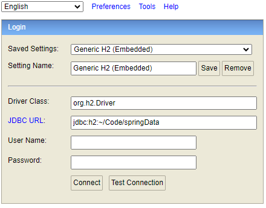
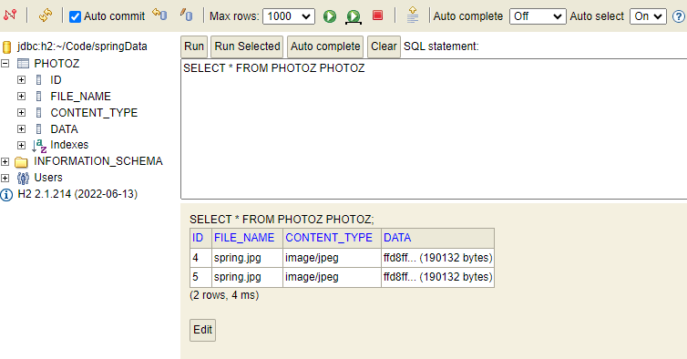
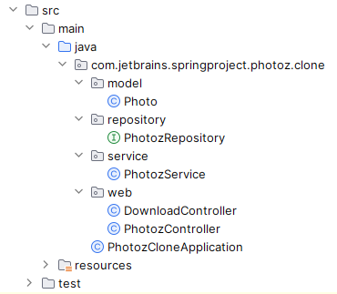

# Spring Boot Photo Databse

A backend project using Spring Boot and SQL to build a photo database.
Supported activity: visit, upload, download, and delete photo; access to SQL database.

### User Instruction
* IDE: IntelliJ, with Java 17 installed. (Make sure it's 17 !)
* Run `PhotozCloneApplication` and open in your browser. Usually the port is `localhost:8080`

### Website Instruction
* Home site contains "Hello world"
* Go to `http://localhost:8080/photoz` to see the list of all photos in the database\
* To add photo, go to `http://localhost:8080/upload.html` to choose photo in your local file and click upload.
* To visit specific photo, go to `http://localhost:8080/photoz/{id}` where `id` is the id of that photo
* To download the photo, go to `http://localhost:8080/photoz/download/{id}` where `id` is the id of that photo.
* To delete photo, go to `http://localhost:8080/photoz/{id}` and open developer tool
  (right click > inspect). Input the following JavaScript into the console, where you replace the
`PUT_ID_HERE` with target photo id:
```
(async function deletePhoto(id) {
    await fetch("http://localhost:8080/photoz/" + id, {method: "DELETE"})
    })("PUT_ID_HERE")
```
* To access the SQL database, go to `http://localhost:8080/h2-console` and delete any username or password that
might pop up in the username or password box, and hit CONNECT. There will be a table initialize and
you can use SQL queries to check the photo data in the database.
\
To display the current table of data, hit `Run Selected` button and the table will be displayed as follows:\



### Code Spec
Main project structure:\
\

* `model/Photo`: Photo object class
* `repository/PhotozRepository`: Photo Repository object class
* `service/PhotozService`: CRUD methods of photo repository, communicate to database
* `web/DownloadController` and `web/PhotozController`: web controllers for all activities
